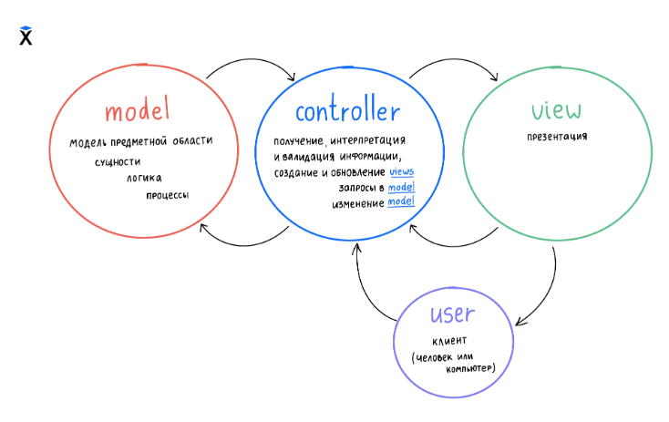

# Домашнее задание 3
## Телефонная книга, паттерн MVC, юнит-тесты
### Ключевые особенности:
- Контроллер отдаёт и принимает данные в виде запросов/ответов с аргументами на основе модуля args
- Разработка по принципу TDD

